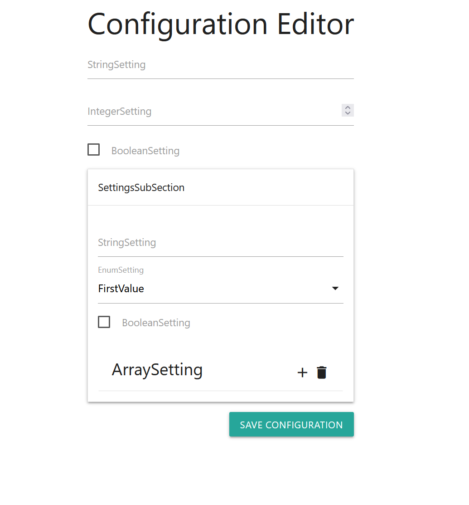

# ConfigurationUI
ConfigurationUI is .Net library for managing **Asp.Net Core** configuration. <br>
It can parse configuration schema from arbitrary .Net type and generate web-page for displaying/editing configuration in user-friendly manner. <br>
ConfigurationUI is fully integrated with with **built-in asp.net core configuration** `Microsoft.Extensions.Configuration`, so __developers don't have to change exiting code__, just continue using well-know patters: `OptionsMonitor<T>`, `IConfiguration`, etc ...

## Installation & Setup

Using ConfigurationUI is very simple, it is done in 4 steps:
- Install nuget package `Opsolutions.ConfigurationUi`
- Create class(es) for describing you application configuration (if not already have):
  ```csharp
  public class Settings
  {
      public string StringSetting { get; set; }
      public int IntegerSetting { get; set; }
      public bool BooleanSetting { get; set; }
      public SettingSubSection SettingsSubSection { get; set; }
  }

  public class SettingSubSection
  {
      public string StringSetting { get; set; }
      public MyEnum EnumSetting { get; set; }
      public bool BooleanSetting { get; set; }
      public string[] ArraySetting { get; set; }
  }
    
  public enum MyEnum { FirstValue, SecondValue }
  ```
- Modify **Program.cs** and insert `.AddConfigurationUi()` method call:
  ```csharp
  public class Program
  {
      public static void Main(string[] args)
      {
          CreateHostBuilder(args).Build().Run();
      }

      public static IHostBuilder CreateHostBuilder(string[] args) =>
          Host.CreateDefaultBuilder(args)
              .AddConfigurationUi<Settings>("settings.json") // insert this line
              .ConfigureWebHostDefaults(webBuilder => { webBuilder.UseStartup<Startup>(); });
  }
  ```
- Modify `Startup.Configure` Method and add configuration middleware with `app.UseConfigurationUi("/configuration")`:
  ```csharp
  public void Configure(IApplicationBuilder app, IWebHostEnvironment env)
  {
      if (env.IsDevelopment())
      {
          app.UseDeveloperExceptionPage();
      }

      app.UseConfigurationUi("/configuration"); // insert this line

      app.UseHttpsRedirection();

      app.UseRouting();

      app.UseAuthorization();

      app.UseEndpoints(endpoints => { endpoints.MapControllers(); });
  }
  ```
  
 It's done. navigate to `/configuration` in browser and you will see configuration editor page: <br>
 
 
 # Important Notes
 
 - Library does not yet support **authorization out of box**. Make sure so place some custom authorization/authentication middleware before `app.UseConfigurationUi("/configuration");` so configuration endpoint will not be accessible everyone
 - Currently web editor does not support or may not work as expected for following .Net types:
   - Dictionaries
   - `FlagsAttribute` decorated enums
   - Nullable value types
   
   ## Any Contribution, Feature Request or Bug Report will be welcome
  
